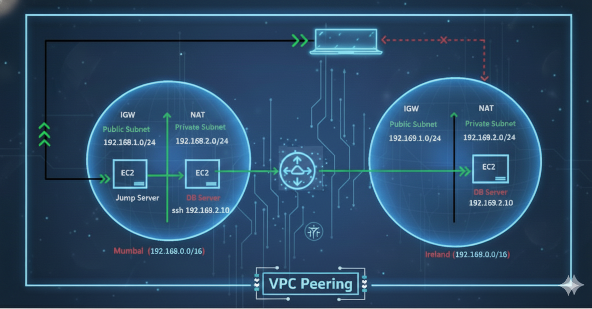

# 🌐 AWS VPC Peering Project

This project demonstrates how to establish **VPC Peering** between two different AWS regions — **Mumbai** and **Ireland** — using **CloudFormation**, **EC2**, and **custom routing**.  
The setup enables **secure private communication** between EC2 instances across regions without using the public internet.

---

## 🧩 Architecture Overview



### 🏗️ VPC Details

| Region      | VPC Name        | CIDR Block     | Components                                                 |
| ----------- | --------------- | -------------- | ---------------------------------------------------------- |
| **Mumbai**  | Mumbaivpcsetup  | 192.168.0.0/16 | Bastion Server (Public Subnet), DB Server (Private Subnet) |
| **Ireland** | Irelandvpcsetup | 192.169.0.0/16 | DB Server (Private Subnet)                                 |

---

## ⚙️ Steps to Implement

### 1️⃣ Create VPCs Using CloudFormation

* Deploy two CloudFormation stacks:
  * **Mumbaivpcsetup** → `192.168.0.0/16` — [](https://github.com/SoumyajitOnCloud9/VPC-Bridge/blob/main/Mumbaivpcsetup.yml)
  * **Irelandvpcsetup** → `192.169.0.0/16` — [](https://github.com/SoumyajitOnCloud9/VPC-Bridge/blob/main/Irelandvpcsetup.yml)
* Each stack provisions VPC, subnets, route tables, IGW, and NAT Gateway.

---

### 2️⃣ Configure Security Groups

* **Mumbai Region:** Create a Security Group allowing SSH access.  
* **Ireland Region:** Create a Security Group for the Ireland DB Server.

---

### 3️⃣ Launch EC2 Instances

* In **Mumbai Region:**
  * Launch **MumbaiBastionServer** in the Public Subnet.
  * Launch **MumbaiDB-Server** in the Private Subnet.  
* In **Ireland Region:**
  * Launch **IrelandDB-Server** in the Private Subnet.

---

### 4️⃣ Access Flow Setup

1. SSH from **Laptop → MumbaiBastionServer**.  
2. From **MumbaiBastionServer → MumbaiDB-Server** using private IP.  
3. Configure access to **IrelandDB-Server** from the MumbaiDB-Server through VPC Peering.

---

### 5️⃣ Configure VPC Peering

#### a. Create VPC Peering Connection

* In the **Mumbai Region**, create a new peering connection named **`MumbaiTOIrelandPeering`** (Requester).  
* In the **Ireland Region**, **accept** the peering request.

#### b. Update Route Tables

* **Mumbai Private Route Table:**  
  Add a route to `192.169.0.0/16` → target **VPC Peering Connection (MumbaiTOIrelandPeering)**.  
* **Ireland Private Route Table:**  
  Add a route to `192.168.0.0/16` → target **VPC Peering Connection (MumbaiTOIrelandPeering)**.

#### c. Update Security Groups

* **Mumbai SG:** Allow inbound **SSH** from CIDR `192.169.0.0/16`.  
* **Ireland SG:** Allow inbound **SSH** from CIDR `192.168.0.0/16`.

#### d. Create Key File in MumbaiDB-Server

```bash
vi Ireland-PEM
```

Paste the Ireland PEM key to allow SSH access from MumbaiDB-Server.

---

### 6️⃣ Verify Connectivity

* From **MumbaiBastionServer**, SSH into **MumbaiDB-Server**.  
* From **MumbaiDB-Server**, SSH into **IrelandDB-Server (192.169.2.10)** using the Ireland PEM key.  
* Successful SSH confirms **VPC Peering** and **private connectivity** between regions.

---

### 🌍 Extending Connectivity to On-Premises Networks

In real-world enterprise environments, organizations often need to connect their **on-premises data centers** to AWS VPCs for hybrid cloud architectures.  
To achieve secure and reliable connectivity from your company network to AWS, you need the following components:

1. **Customer Gateway (CGW)** — Represents your on-premises router or firewall that connects to AWS.  
2. **Virtual Private Gateway (VGW)** — AWS-side gateway attached to your VPC that enables VPN connectivity.  
3. **Site-to-Site VPN Connection** — Establishes an encrypted IPsec tunnel between your CGW and VGW, allowing secure data transfer between on-premises and AWS environments.

> 💡 **Note:**  
> Combining **VPC Peering** (for inter-VPC communication) with **Site-to-Site VPNs** (for hybrid connectivity) creates a robust and scalable multi-environment network topology — often used in corporate and production-grade setups.

---

## 🧹 Effective Cleanup Steps

Cleanup is a **critical step** in any AWS project to ensure that no unnecessary resources continue to incur costs or cause configuration conflicts.  
After verifying connectivity between Mumbai and Ireland VPCs, perform the following cleanup steps carefully:

1. **Terminate all EC2 Instances**
   * Terminate both instances in **Mumbai VPC** (`MumbaiBastionServer`, `MumbaiDB-Server`).  
   * Terminate the instance in **Ireland VPC** (`IrelandDB-Server`).

2. **Delete VPC Peering Connection**
   * Remove the **MumbaiTOIrelandPeering** connection from the Mumbai region and confirm its deletion in Ireland.

3. **Delete Security Groups (SGs)**
   * Delete custom Security Groups created in both regions to avoid leftover inbound rules or CIDR entries.

4. **Delete CloudFormation Stacks**
   * Delete the stacks (`Mumbaivpcsetup` and `Irelandvpcsetup`) to automatically remove associated VPCs, subnets, route tables, NAT gateways, and IGWs.

5. **Verify Resource Deletion**
   * Double-check both regions to ensure all resources (VPCs, subnets, and peering connections) have been successfully deleted.

> 🧠 **Tip:** Always perform cleanup immediately after testing to maintain a cost-efficient and secure AWS environment.

---

## 🧠 Key Learnings

* Configured **cross-region VPC Peering** using CloudFormation and manual networking setup.  
* Secured communication through **private IP routing** (no public internet exposure).  
* Understood **route table modifications**, **security group dependencies**, and **bastion-based access**.  
* Practiced **infrastructure teardown** using CloudFormation cleanup.

---

## 🧑‍💻 Author

**Soumyajit Saha**  
*Aspiring AWS & DevOps Engineer*  
🔗 [LinkedIn](https://www.linkedin.com/in/soumyajit-saha-5a8932282/) | [GitHub](https://github.com/SoumyajitOnCloud9/VPC-Bridge/tree/main)

---
## 🏷️ License

Licensed for **educational & demo purposes**.  
Feel free to fork and adapt for your own AWS DevOps learning path.  

---


🌟 **Like what you see?** Give this repo a star and share it with fellow cloud enthusiasts!  
☁️ **More AWS projects are on the way — stay connected!**

